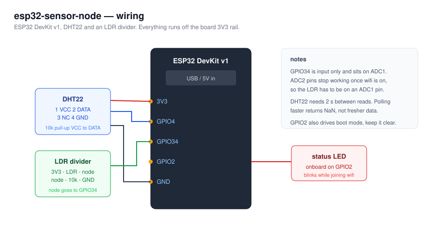

# Wiring



## Pin map

| Board pin | Goes to | Notes |
|---|---|---|
| 3V3 | DHT22 pin 1, top of the LDR divider | both sensors run at 3.3 V, do not feed them 5 V |
| GPIO4 | DHT22 pin 2 (data) | needs a 10 kΩ pull-up to 3V3 |
| GPIO34 | midpoint of the LDR divider | input only pin, ADC1 channel 6 |
| GPIO2 | onboard LED | already wired on the DevKit, nothing to add |
| GND | DHT22 pin 4, bottom of the divider | one common ground |

DHT22 pin 3 is not connected on any board I have seen. Pin 1 is the one closest to the grille
when you look at the front.

## The LDR divider

```
3V3 ──[ LDR ]──┬── GPIO34
               │
             [10k]
               │
              GND
```

More light means less LDR resistance, which pulls the midpoint closer to 3V3, so the ADC value
goes up. If yours reads backwards, swap the LDR and the resistor.

10 kΩ is a reasonable middle for a common GL5516 in indoor light. If the reading pins at 0 or
4095 all day, change the fixed resistor rather than fighting it in software.

## Things that cost me time

**ADC2 dies when WiFi is on.** The ESP32 shares ADC2 with the WiFi radio, so any analog read on
those pins returns garbage or blocks once the radio is up. GPIO34 is on ADC1, which is why the
LDR is there. This is documented and still catches everyone.

**The DHT22 is slow.** Minimum 2 s between reads. The firmware samples every 5 s. If you shorten
the interval you get NaN, and the failed read counter in the dashboard is exactly how I noticed.

**Attenuation matters.** By default the ADC only covers roughly 0 to 1.1 V. `ADC_11db` in
`setup()` extends the usable range to about 3.1 V, which is what a 3.3 V divider needs. Without
it, everything above a third of the range reads as 4095.

**GPIO2 is a strapping pin.** It is fine as the status LED, but if you ever hang something on it
that pulls it low at boot, the board drops into download mode instead of running your firmware.

## Bill of materials

- ESP32 DevKit v1 (30 pin)
- DHT22 / AM2302 temperature and humidity sensor
- LDR, GL5516 or similar
- 10 kΩ resistor, two of them (one pull-up, one divider leg)
- breadboard and jumper wires
